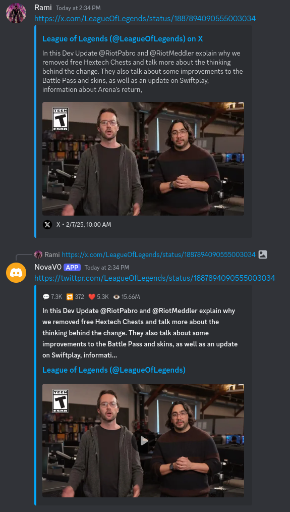
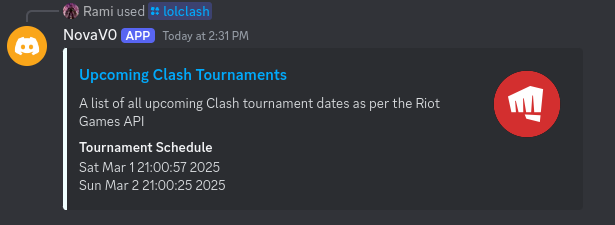
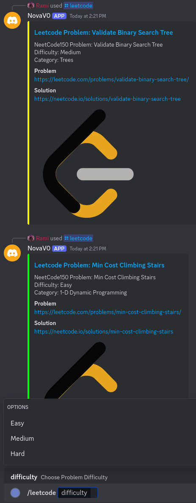

# NOVA
A Discord bot built via C++ and the DPP library. 

## Features
1. Fixes embed issues with videos uploaded to Discord Chat from Social Media Platforms to enable playing media without leaving discord on any device (e.g. TikTok, Instagram, YouTube Shorts etc.)
2. Fetches the latest tournament (Clash) dates for League of Legends from the Riot Games API
3. Fetches random LeetCode Problems and their NeetCode solution. Users can filter fetch by difficulty or question category.
4. Multiplatform: runs on Ubuntu/Debian, MacOS & Windows out of the box.  

## Setup 
> Note: you need to supply a `BOT_TOKEN` in a .env file to run the bot. 
### Ubuntu, Debian & MacOS
Clone the repository and navigate to it
```
git clone https://github.com/RamiE965/nova
cd nova
```
Install dependancies (Ubuntu/Debian)
```
sudo apt-get install build-essential cmake libssl-dev zlib1g-dev
```
Install dependancies (MacOS)
```
brew install cmake
brew install libdpp
brew install openssl
```
Build and run the project (using run.sh)
```
chmod +x run.sh
./run.sh
```

### Windows
> This assumes you are using Visual Studio with the C++ development workload. You also need to have `VCPKG` and `CMAKE` installed.

Clone the repository and navigate to it
```
git clone https://github.com/RamiE965/nova
cd nova
```
Install required libraries using VCPKG
```
vcpkg install dpp:x64-windows
vcpkg install cpr:x64-windows
```
Configure the project in Visual Studio
```
On Visual Studio, select "Open a local folder" and select NOVA. Then use the play button to build and run the project.
```
Otherwise, build the project manually and run the bot
```
mkdir build
cd build
cmake .. -DCMAKE_TOOLCHAIN_FILE="C:\vcpkg\scripts\buildsystems\vcpkg.cmake"
cmake --build . --config Release
cd Release
NOVA.exe
```

You got it. Yay! 🎉

## Screenshots
### 1. Social Media Embed Fix
> Fixes embed issues by allowing playing social media posts (in this case X/Twitter video) from within Discord
 

### 2. League Of Legends Clash Tournament Schedule
> Fetches the latest tournament (Clash) dates for League of Legends from the Riot Games API


### 3. Generate random LeetCode problem with accompanying NeetCode solution
> Fetches random LeetCode Problems and their NeetCode solution. Users can filter fetch by difficulty or question category.


